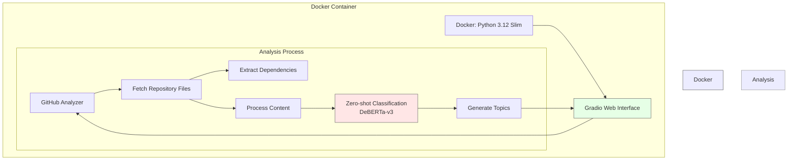

# GitHub Topic Generator

It automatically generates relevant GitHub topics from **GitHub URL**. It uses zero-shot to analyze repository content and suggest appropriate topics based on the selected categories.

Try here : [Hugging Face Space](https://huggingface.co/spaces/Namgyu-Youn/topic-generator)

**⬇️ Sample Image ⬇️**




## ✨ Features
- **Analyzes GitHub repository files** (README.md, requirements.txt, .. etc.)
- Generates relevant topics based on **content analysis**
- Supports multiple categories including Data & AI, Scientific Research
- Provides topic recommendations based on category selection

## ➕ Prerequisites
- Python 3.10 or higher
- Optional : Docker, Poetry
- transformer
- aiohttp

## 🚩 How to use?

``` bash
git clone https://github.com/Namgyu-Youn/github-topic-generator.git
cd github-topic-generator
```

### Option 1: Using Poetry (Higly Recommended)
```bash
curl -sSL https://install.python-poetry.org | python3 - # Optional

poetry install
poetry run python app.py
```

### Option 2: Using Docker
```bash
docker-compose up --build
```

### Option 3: Standard Python Setup
```bash
python -m venv env

# On Windows
env\Scripts\activate
# On macOS/Linux
source env/bin/activate

pip install -r requirements.txt
python app.py
```

## 🧐 Introduction about gradio UI

1. Enter GitHub URL
2. Select the main, sub category that best matches your repository
3. Click "Generate Topics" to get your results
4. Enjoy generated topics('#')! It can be used like this.


## 👥 Contribution guide : [CONTRIBUTING.md](https://github.com/Namgyu-Youn/github-topic-generator/blob/main/CONTRIBUTING.md)
Thanks for your interest. I always enjoy meaningful collaboration. <br/>
Do you have any question or bug?? Then submit **ISSUE**. You can also use awsome labels(🏷️).
