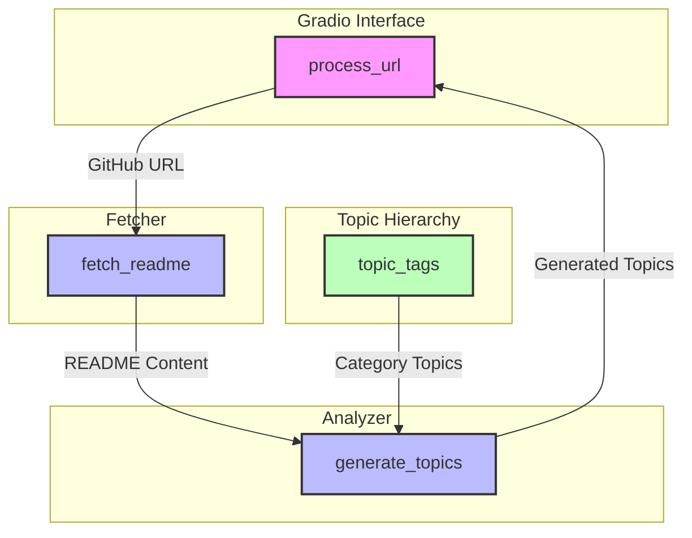

# GitHub Topic Generator

It automatically generates relevant GitHub topics from **README.md URL**. It uses zero-shot to analyze repository content and suggest appropriate topics based on the selected categories.

**⬇️ Sample Image ⬇️** (Try here : [Hugging face URL](https://huggingface.co/spaces/Namgyu-Youn/tag-generator))



---

## ✨ Features
- Analyzes GitHub repository README.md files
- Generates relevant topics based on content analysis
- Supports multiple categories including Data & AI, Scientific Research
- Provides topic recommendations based on category selection
- User-friendly Gradio interface

## ➕ Prerequisites
- Python 3.10 or higher
- Docker (optional)
- Poetry (optional)
- transformer

## 🚩 Installation

### Option 1: Standard Python Setup

1. Clone the repository
```bash
git clone https://github.com/Namgyu-Youn/github-topic-generator.git
cd github-topic-generator
```

2. Create and activate virtual environment
```bash
python -m venv env
# On Windows
env\Scripts\activate
# On macOS/Linux
source env/bin/activate
```

3. Install dependencies
```bash
pip install -r requirements.txt
```

### Option 2: Using Poetry

1. Install Poetry
```bash
curl -sSL https://install.python-poetry.org | python3 -
```

2. Clone and install dependencies
```bash
git clone https://github.com/Namgyu-Youn/github-topic-generator.git
cd github-topic-generator
poetry install
```

### Option 3: Using Docker

1. Clone the repository
```bash
git clone https://github.com/yourusername/github-topic-generator.git
cd github-topic-generator
```

2. Build and run with Docker Compose
```bash
docker-compose up --build
```

## 🚀 Usage

### Running the Application

1. Start the Gradio interface:
```bash
# If using standard Python setup
python gradio_app.py

# If using Poetry
poetry run python gradio_app.py

# If using Docker
# The application will start automatically after docker-compose up
```

2. Open your web browser and navigate to:
```
http://localhost:7860
```

### Using the Interface

1. Enter a GitHub README.md URL
2. Select the main category that best matches your repository
3. Choose a sub-category for more specific topic generation
4. Click "Generate Topics" to get your results


## 👥 Contribution guide : [CONTRIBUTING.md](https://github.com/Namgyu-Youn/github-topic-generator/blob/main/CONTRIBUTING.md)
Thanks for your interest. I always enjoy meaningful collaboration. <br/>
Do you have any question or bug?? Then submit **ISSUE**. You can also use awsome labels(🏷️).
